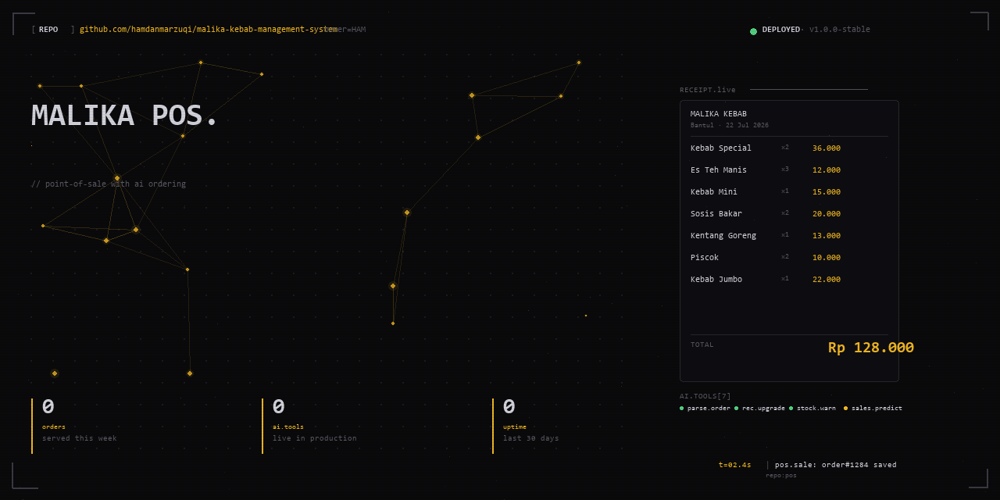

  

# Malika Kebab Management System

POS system for Malika Kebab booth, Bantul, Yogyakarta. Built with Node.js + Express + SQLite, integrated with Groq AI for order parsing, upsell recommendations, and sales prediction. Live in production, served daily.

## Features

- **Order management** — receipt scanning, totals, payment tracking
- **AI Tools (7)** — parse order from free-text, recommend upgrades, warn on low stock, predict sales
- **Google Sheets CMS** — menu management, daily sales dashboard
- **Offline-first** — SQLite local storage

## Stack

`Node.js` `Express` `SQLite` `Groq API` `Google Sheets API` `Chart.js` `SPA`

## Status

🟢 **Live in production** — serving real customers, real revenue.
